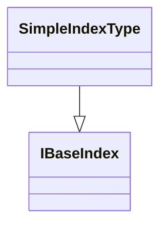
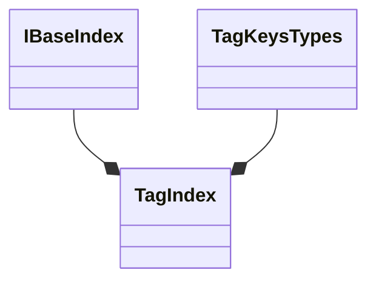
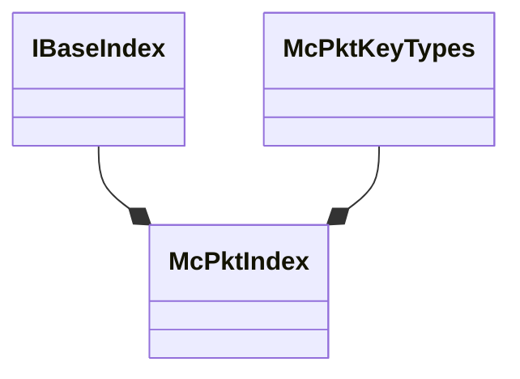
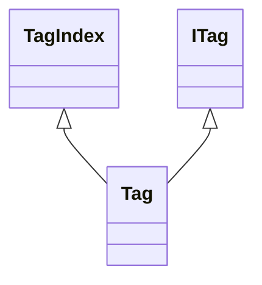

# Simple 

```mermaid
classDiagram 
  SimpleIndexType --|> IBaseIndex
```

# TagIndex

```mermaid
classDiagram 
  IBaseIndex --* TagIndex
  TagKeysTypes --* TagIndex
```

```mermaid
classDiagram 
  IBaseIndex --* McPktIndex
  McPktKeyTypes --* McPktIndex
```

# Tag

```mermaid
classDiagram 
  TagIndex <|-- Tag 
  ITag <|-- Tag 
  
```
      
            