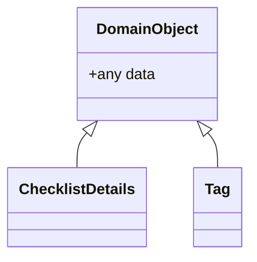

# Simple 



```mermaid
%%{init: {'securityLevel': 'loose', 'theme':'default'}}%%
gantt
    title The "offline" project
    dateFormat  DD-MM-YYYY

    Section Web App
      Add ServiceWorker template    :a1, 2d
      Add Custom URL routing        :after a1, 7d
      Map DTOs to IndexedDB schema  :a2, 7d
      Generic Repository for CRUD operations:a3, after a2, 4d
      Repository Tag                :after a3, 1d
      Repository McPkgPreview       :after a3, 1d
      Repository IWoPreview         :after a3, 1d
      Repository ITagPreview        :after a3, 1d
      Repository IPoPreview         :after a3, 1d
      Repository IChecklistPreview  :after a3, 1d
      Repository IPunchPreview      :after a3, 1d

      Dixie decryption/encryption   :a4, 3d

      UI for selection offline scope:a3,  5d

      Load offline data from Main API:a5, 10d


    section Main API
    Create offline scope : a1, 4d
    Add API for GET offline scope  :a1, 12d
    
    another task                        :after a1, 4d
    
    section PCS MAIN
    UI offline scope (Select MCPkg with disciplineCode)      :pcs1, 12d
    Save to database      :pcs1, 4d


```